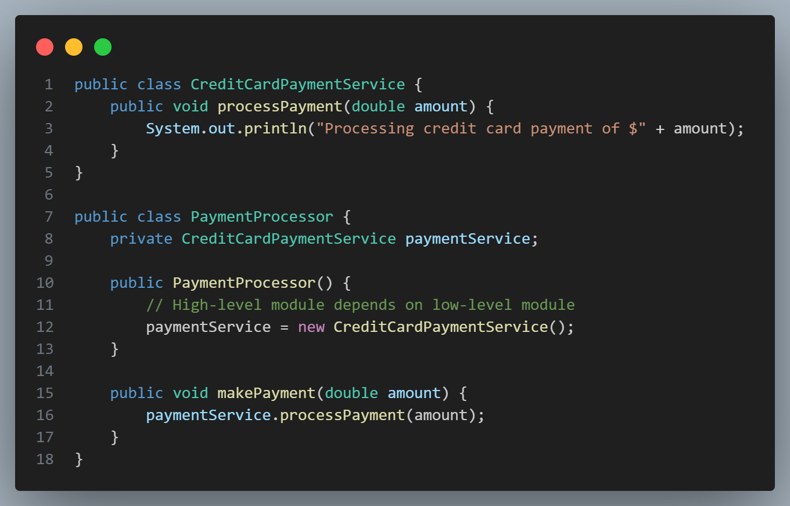
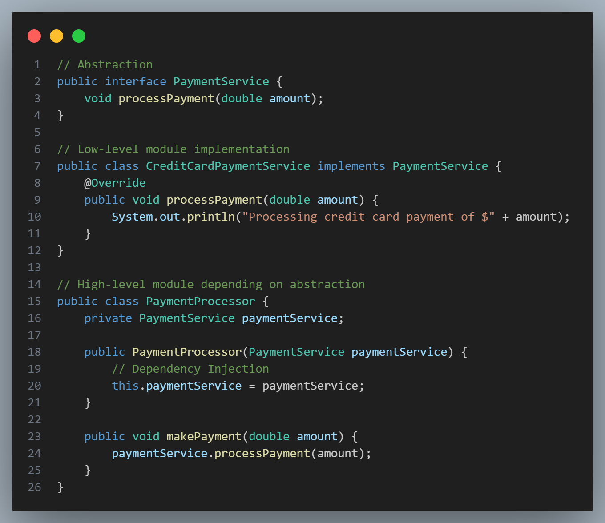

# [Dependency Inversion Principle (DIP)](#dependency-inversion-principle-dip)

 

The **Dependency Inversion Principle (DIP)** is the final principle in the SOLID design principles and emphasizes designing flexible, maintainable systems by inverting the traditional flow of dependencies in code.

> **Principle Definition:** “High-level modules should not depend on low-level modules. Both should depend on abstractions. Abstractions should not depend on details. Details should depend on abstractions.”

### [Key Concepts of Dependency Inversion Principle](#key-concepts-of-dependency-inversion-principle)

- **High-Level Modules**: These are components or classes that encapsulate significant business logic or functionality. They should be the core logic that drives the application’s purpose.
- **Low-Level Modules**: These include components that handle more specific, detailed tasks like database connections or network requests.
- **Abstractions**: These are typically interfaces or abstract classes. DIP promotes a system where both high- and low-level modules depend on abstractions rather than each other directly.

By inverting dependencies, DIP encourages high-level modules to rely on abstract interfaces, making the code more flexible and easier to change or extend.

### [Why Dependency Inversion is Important](#why-dependency-inversion-is-important)

1. **Decoupling**: High-level modules and low-level modules can change independently as long as they conform to the same abstraction.
2. **Enhanced Flexibility**: Using abstractions makes it easier to swap implementations (e.g., switching from one database provider to another) without major changes to the codebase.
3. **Ease of Testing**: Abstractions allow easy mocking or stubbing of dependencies, making unit testing simpler and more reliable.

### [Violation of Dependency Inversion Principle](#violation-of-dependency-inversion-principle)

Imagine a scenario where a `PaymentProcessor` class depends directly on a `CreditCardPaymentService` for processing payments:

 

In this example:
- The `PaymentProcessor` is tightly coupled to `CreditCardPaymentService`.
- This code violates DIP because `PaymentProcessor` (high-level module) depends directly on `CreditCardPaymentService` (low-level module).

### [Refactoring to Follow Dependency Inversion Principle](#refactoring-to-follow-dependency-inversion-principle)

To comply with DIP, introduce an abstraction (interface) that represents the payment service:

 

Now, `PaymentProcessor` depends on the `PaymentService` abstraction rather than a specific implementation (`CreditCardPaymentService`). This refactoring allows flexibility to change the `PaymentService` implementation without modifying `PaymentProcessor`.

### [Benefits of Dependency Inversion Principle](#benefits-of-dependency-principle)

1. **Modularity**: High-level classes remain independent of specific low-level implementations, promoting a more modular codebase.
2. **Reusability**: High-level modules can easily be reused with different implementations of the same abstraction.
3. **Ease of Maintenance**: Changes in low-level modules do not directly affect high-level modules.
4. **Improved Testability**: With dependency injection and abstractions, it’s easier to mock dependencies, facilitating effective unit testing.

### [Dependency Injection](#dependency-injection)

**Dependency Injection** is a common method of implementing DIP by passing dependencies (like `PaymentService`) into classes rather than creating them internally. It allows you to inject different implementations at runtime, further enhancing flexibility.

By following the Dependency Inversion Principle, your codebase becomes more adaptable to change, modular, and test-friendly. The high-level logic remains intact and isolated from low-level implementation details, leading to a more stable and scalable system.

