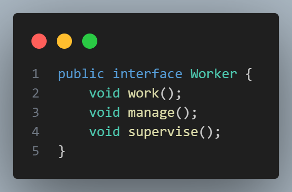
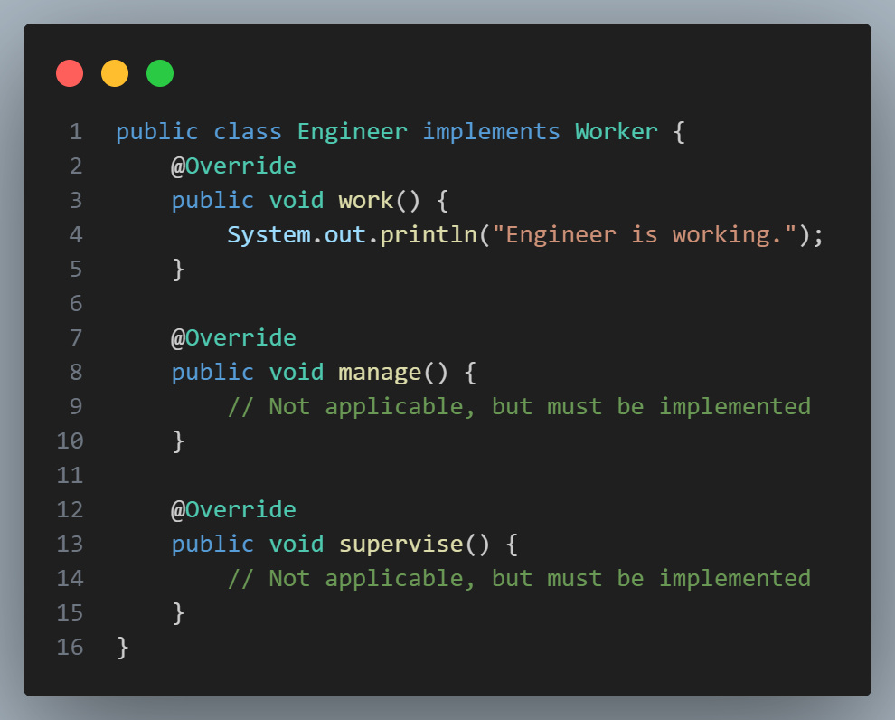
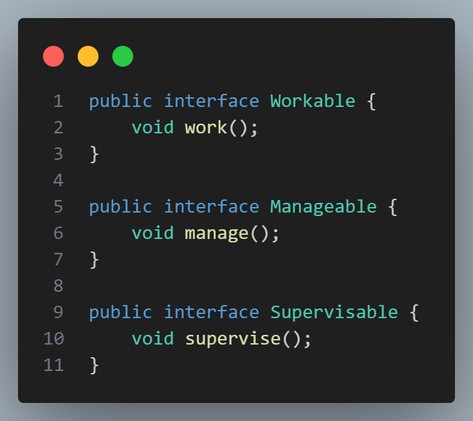
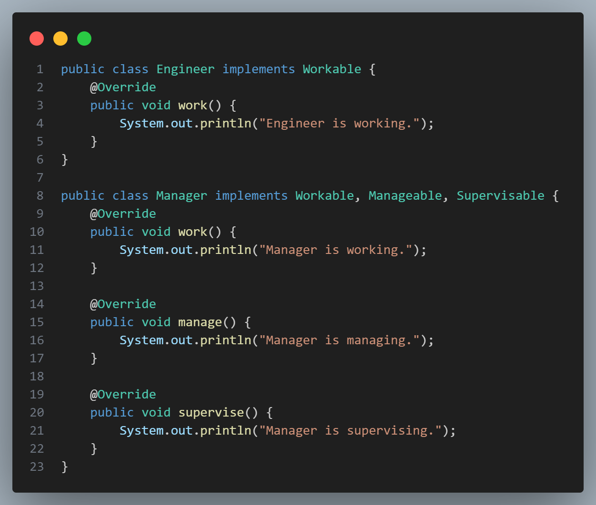

# [Interface Segregation Principle (ISP)](#interface-segregation-principle)

 

The **Interface Segregation Principle (ISP)** is a fundamental aspect of the SOLID principles in object-oriented design. ISP encourages designing smaller, more specific interfaces rather than larger, generalized ones.

> **Principle Definition:** “A client should not be forced to depend on interfaces it does not use.”

This principle is all about avoiding **fat interfaces** — interfaces that define a broad set of methods, some of which may not be relevant to all classes that implement them. By applying ISP, each interface becomes focused on a particular responsibility, leading to more cohesive and maintainable code.

### [Why Interface Segregation Matters](#why-interface-segregation-matters)

- **Avoids Unnecessary Implementations**: If an interface has methods that a class doesn’t need, that class would have to implement unnecessary methods, often with empty implementations.
- **Improves Code Flexibility**: Smaller, specific interfaces allow classes to depend only on the methods they actually use, making the code more adaptable to change.
- **Encourages Loose Coupling**: When interfaces are focused and minimal, changes in one part of the code have less impact on other parts, leading to more maintainable code.

### [Example of Violating ISP](example-of-violating-isp)

Consider an interface `Worker` with methods that aren’t applicable to all types of workers:

 

If we have both `Engineer` and `Manager` classes implementing `Worker`, `Engineer` would still need to implement `manage()` and `supervise()` even though it doesn’t use them:

 

This design is rigid and violates ISP because the `Engineer` class is forced to depend on methods it does not need.

### [Refactoring to Comply with ISP](#refactoring-to-comply-with-isp)

To follow ISP, we can break the `Worker` interface into smaller, more specific interfaces:

 

Now, `Engineer` and `Manager` can implement only the interfaces relevant to them:

 

### [Benefits of Following ISP](#benefits-of-following-isp)
1. **Focused Interfaces**: By keeping interfaces focused, each implementing class can adhere to only the methods it needs.
2. **Improved Code Clarity**: Smaller interfaces make it clear what functionality a class offers without the clutter of irrelevant methods.
3. **Easier Testing**: Testing is more straightforward with specific interfaces, as each class is only responsible for its relevant functionality.
4. **Greater Extensibility**: Code can grow and adapt more easily as the system expands because changes in one interface won’t impact classes that don’t depend on it.

By adhering to ISP, your code is more modular, flexible, and easy to maintain, with interfaces that clearly define the expectations for each class.

