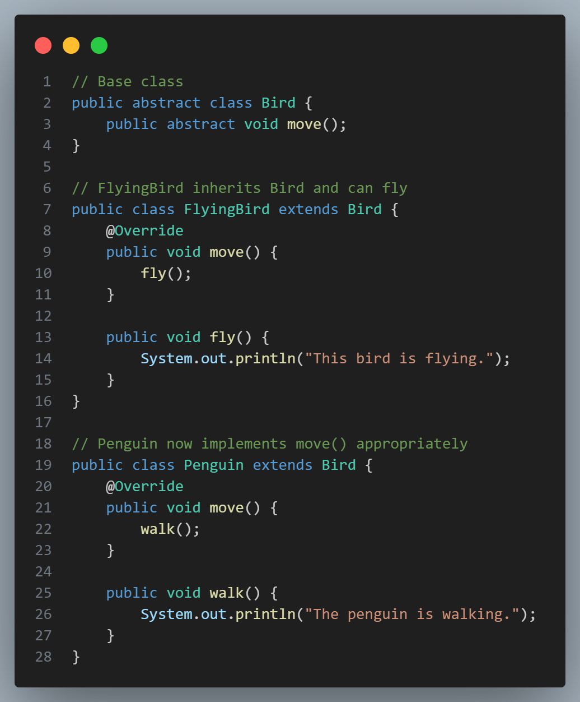

# [Liskov Substitution Principle (LSP)](#liskov-substitution-principle-lsp)

 

The **Liskov Substitution Principle (LSP)** is one of the SOLID principles of object-oriented design and is defined as follows:

> **"Objects of a superclass should be replaceable with objects of a subclass without affecting the correctness of the program."**

This means that if you have a class that is using a superclass, you should be able to replace it with any subclass of that superclass without causing unexpected behavior or errors.

### [Why LSP Matters](#why-lsp-matters)

LSP ensures that derived classes extend the functionality of base classes without changing their expected behavior. This helps in:
- **Building Stable and Reliable Systems**: Substituting subclasses should not break or alter the behavior of the system.
- **Promoting Reusability**: Classes and functions can work with base types or interfaces, making code more modular and reusable.
- **Enhancing Maintainability**: If subclasses are consistently substitutable, developers can confidently extend functionality without risking instability.

### [How to Achieve LSP](#how-to-achieve-lsp)

To adhere to LSP:
- Ensure that a subclass honors the contract established by the base class. For instance, methods in the subclass should not weaken the preconditions or strengthen the postconditions of methods from the base class.
- Avoid overriding base class methods in ways that deviate from the base class’s intended behavior.
- Do not throw exceptions that the base class does not expect.

### [Example of Violating LSP](#example-of-violating-lsp)

Let’s consider a base class `Bird` and a derived class `Penguin`:

 

Here, substituting a `Bird` object with a `Penguin` object breaks LSP because `Penguin` doesn’t truly fulfill the contract of `Bird`. Any code relying on `Bird`’s `fly()` method will throw an exception if a `Penguin` is passed, causing unexpected behavior.

### [Refactoring to Comply with LSP](#refactoring-to-comply-with-lsp)

A better approach is to redesign the class hierarchy by segregating behaviors:

 

In this refactored design:
- `Bird` represents the general concept of a bird.
- `FlyingBird` and `Penguin` both inherit `Bird` and define `move()` according to their specific behaviors, without assuming all birds can fly.

Now, we can substitute any `Bird` instance with either a `FlyingBird` or `Penguin`, ensuring that the code adheres to LSP.

### [Benefits of Following LSP](#benefits-of-following-lsp)
1. **Consistent Behavior**: Derived classes respect the expected behavior of their base class.
2. **Reusable Code**: Base classes and methods can work with any derived class, promoting code reuse.
3. **Easier Testing and Maintenance**: LSP-compliant designs ensure that substituting objects of subclasses won’t introduce unexpected issues, simplifying testing and maintenance. 

By following the Liskov Substitution Principle, we create designs that are flexible, reliable, and easier to work with, especially in larger systems where polymorphism is extensively used.

