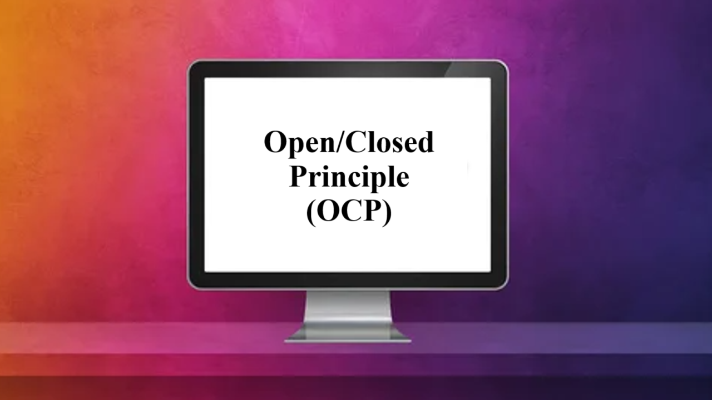
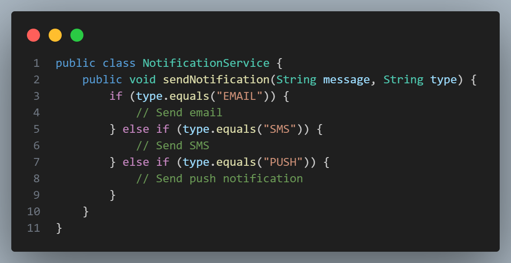
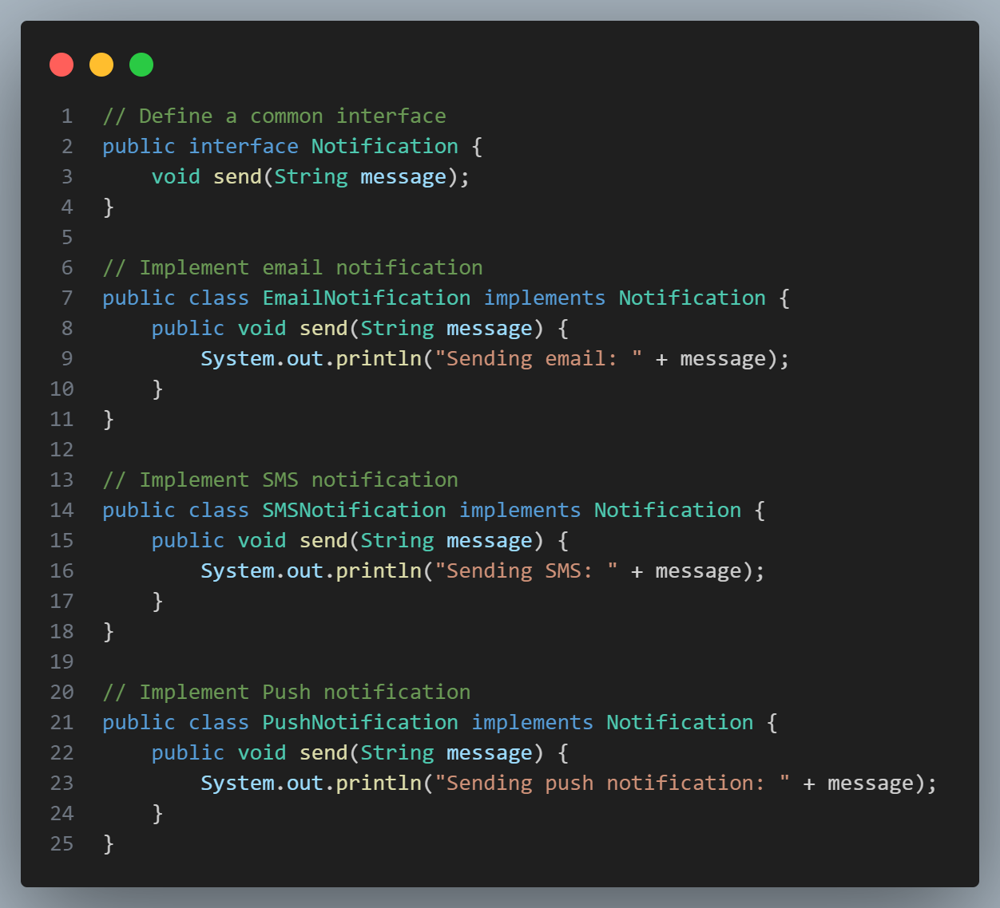
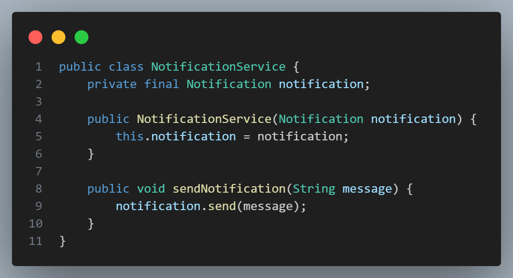

# [Open/Closed Principle (OCP)](#open-closed-principle-ocp)

 

The **Open/Closed Principle (OCP)** is a fundamental concept in object-oriented design. It states that:

> **"Software entities (such as classes, modules, and functions) should be open for extension, but closed for modification."**

This means you should design classes and modules in a way that allows you to add new functionality or extend their behavior without modifying the existing code. 

### [Why OCP Matters](#why-ocp-matters)

Following OCP can help make your code:
- **Stable and Robust**: Existing code remains unchanged, reducing the risk of introducing bugs.
- **Flexible**: Allows for new features and behaviors without affecting existing functionality.
- **Maintainable**: Code can evolve as requirements change, while maintaining the integrity of the core functionality.

### [How to Achieve OCP](#how-to-achieve-ocp)
To implement OCP, you generally use **abstraction** and **polymorphism** by defining base classes or interfaces. This allows subclasses to extend or add new behaviors, rather than modifying the existing code directly.

### [Example in Java](#example-in-java)
Let’s say we have a notification system. Initially, the system only supports **Email notifications**, but we want to extend it later to support **SMS and Push notifications**.

Without OCP, you might have a `NotificationService` class with a single `sendNotification` method:

 

In this design, adding a new notification type requires modifying `NotificationService`, breaking the OCP.

#### Refactoring with OCP
Instead, we can create an interface `Notification` and then define different classes for each type of notification. This way, `NotificationService` is **closed for modification** but **open for extension** when adding new notification types.

 

Now, the `NotificationService` only depends on the `Notification` interface:

 

#### Adding New Notification Types
If you want to add a new notification type, such as **SlackNotification**, you simply create a new class implementing `Notification` without altering `NotificationService`.

 

### [Benefits of This Approach](#benefits-of-this-approach)
1. **OCP Compliance**: We extended functionality without modifying existing code.
2. **Easily Scalable**: New notification types can be added as separate classes, keeping the main service stable.
3. **Loose Coupling**: The `NotificationService` class depends on the interface `Notification`, not on concrete implementations. This improves flexibility and makes the code easier to test and maintain. 

By following the Open/Closed Principle, you can make your code more adaptable to changing requirements and ensure it’s future-proof.
