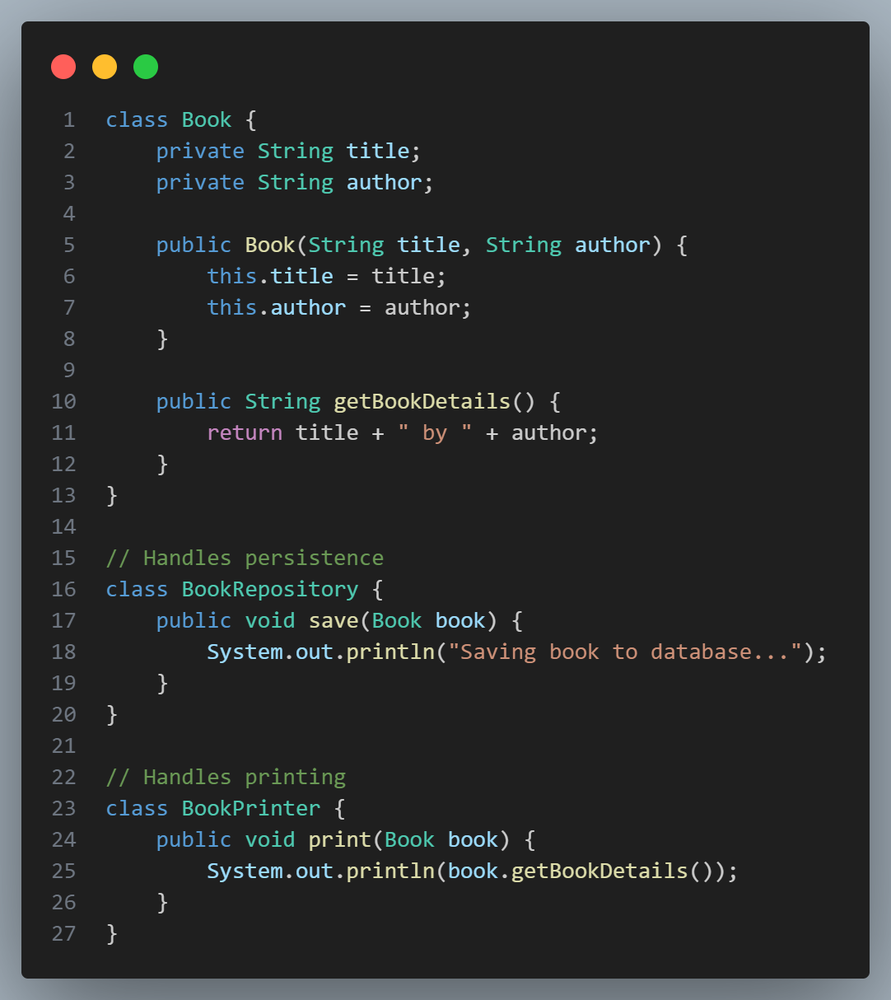

# [Single Responsibility Principle (SRP)](#single-reponsibility-principle-srp)

 

The **Single Responsibility Principle (SRP)** is one of the five **SOLID principles** in object-oriented design, emphasizing that -
> **A class or module should have only one reason to change.**

In other words, **a class should be responsible for only one part of a program's functionality**. This principle encourages a separation of concerns, making each class focused, easier to understand, and more maintainable.

### [Key Benefits of SRP](#key-benefits-of-srp):
1. **Improved Readability**: Classes with a single responsibility are easier to read and understand since they handle only one functionality.
2. **Easier Maintenance**: Changes in one part of the application require modifications in only one class, reducing the risk of introducing bugs.
3. **Enhanced Testability**: With fewer functions, single-responsibility classes are simpler to test.
4. **Reduced Coupling**: The principle promotes low coupling by keeping concerns separated.

### [Example of SRP in Java](#example-of-srp-in-java)

Suppose we’re building a system for managing a book. 

Without SRP, a `Book` class might handle all aspects of book management, such as storing details, saving book data, and printing book information:

#### Without SRP:

 

Here, the `Book` class violates SRP because it’s responsible for:
- Storing book details
- Saving book data (persistence)
- Printing book information

This makes the class more complex, tightly coupled, and harder to maintain.

#### With SRP:

By applying SRP, we can split these responsibilities into separate classes:

 

Here:
- The `Book` class is responsible only for storing book data.
- `BookRepository` handles saving the book data.
- `BookPrinter` manages printing book details.

Each class has a single responsibility, making the code easier to read, test, and maintain.
