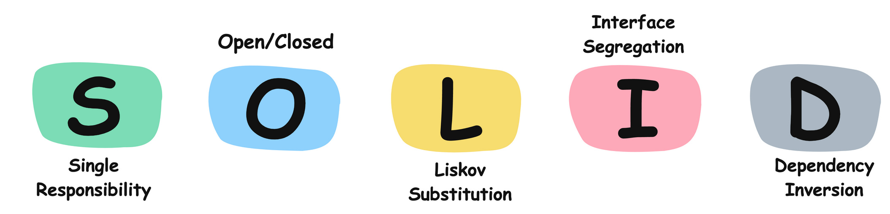

# [SOLID Principles](#solid-principles)
The **SOLID Principles** are a set of five core guidelines in object-oriented design aimed at creating understandable, flexible, and maintainable software. 

These principles were introduced by Robert C. Martin (also known as Uncle Bob) and are widely used by developers to ensure code quality and reduce the chances of technical debt. 

 

Here’s a brief overview of each principle:

- **S** - **Single Responsibility Principle (SRP)**: A class should have only one reason to change, meaning it should have only one job or responsibility.

- **O** - **Open/Closed Principle (OCP)**: Software entities (like classes, modules, functions) should be open for extension but closed for modification, promoting the use of inheritance or interfaces for adding functionality without altering existing code.

- **L** - **Liskov Substitution Principle (LSP)**: Subtypes should be substitutable for their base types without altering the correctness of the program, ensuring that subclasses can stand in for parent classes seamlessly.

- **I** - **Interface Segregation Principle (ISP)**: Clients should not be forced to depend on interfaces they do not use. This principle encourages creating specific, small interfaces instead of one large, general-purpose one.

- **D** - **Dependency Inversion Principle (DIP)**: High-level modules should not depend on low-level modules. Both should depend on abstractions, reducing tight coupling and enhancing code flexibility. 

Following the **SOLID** principles leads to a well-structured, modular, and testable codebase that’s easier to adapt to changes and extend over time.
1. [Single Responsibility Principle](SingleResponsibilityPrinciple.md#single-reponsibility-principle-srp)
2. [Open/Closed Principle](OpenClosedPrinciple.md#open-closed-principle-ocp)
3. [Liskov Substitution Principle](LiskovSubstitutionPrinciple.md#liskov-substitution-principle-lsp)
4. [Interface Segregation Principle]()
5. [Dependency Inversion Principle]()

