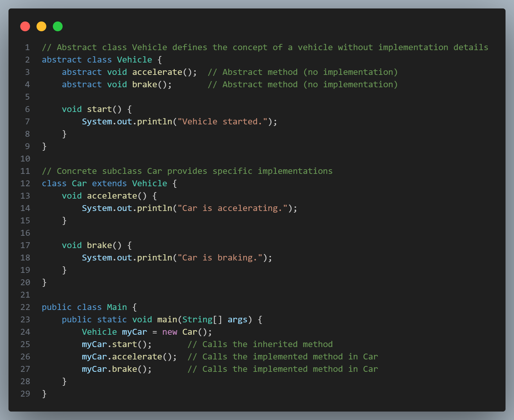

# [Object Oriented Design (OOD)](#object-oriented-design-ood)

Object-Oriented Design (OOD) is a programming paradigm centered around the concepts of "objects," which represent real-world entities and encapsulate data and behavior. OOD emphasizes creating modular, reusable, and maintainable code by organizing software into well-defined structures.

Here are the core concepts of OOD:

 

# [Core Principles of Object-Oriented Design (OOD)](#core-principles-of-object-oriented-design-ood)

## *️⃣ [Encapsulation](#encapsulation)

Encapsulation is one of the fundamental principles of Object-Oriented Design (OOD) that refers to the bundling of data (attributes) and methods (functions) that operate on that data into a single unit, or object. This concept allows for data hiding and protects the internal state of the object from direct modification, thus promoting data integrity and abstraction.

### 💠 Key Aspects of Encapsulation -

#### 🔸 Data Hiding:

Encapsulation restricts direct access to some of an object's components, which is known as data hiding.  
Only the methods defined in the class can access and modify the internal state of the object, preventing outside interference and misuse.

#### 🔸 Public and Private Access Modifiers:

Attributes of a class can be marked as private or protected, meaning they cannot be accessed directly from outside the class. Only public methods (also known as getters and setters) can interact with these attributes.  
Example:  
Private attribute: Only accessible within the class itself.  
Public methods: Can be used by other classes or code to access or modify the private attributes.

#### 🔸 Control Over Data:

By exposing methods to interact with the internal state, the class can enforce rules or constraints when data is accessed or modified. This ensures that the object remains in a valid state.  
For example, a class can validate input values before setting them, ensuring that an object does not enter an inconsistent or invalid state.

### 💠 Example of Encapsulation in Java -

Here’s a simple Java example to illustrate encapsulation:

 

#### 🔸 Explanation of the Example -

**Private Attributes:**  
The accountNumber and balance attributes are marked as private, so they cannot be accessed directly from outside the BankAccount class.

**Public Methods:**  
The deposit and withdraw methods allow controlled access to modify the balance attribute. These methods contain logic to check whether the amount is valid before performing the operation.

**Getters:**  
The getBalance method allows outside code to retrieve the current balance without exposing the balance attribute directly.

### 💠 Advantages of Encapsulation -

1. **Improved Data Security:** By restricting access to an object’s data, encapsulation prevents accidental changes or corruption.  
2. **Modularity:** Changes in the implementation of the class do not affect other classes that use it, as long as the public interface remains unchanged.  
3. **Ease of Maintenance:** Since the internal workings of a class are hidden, developers can modify and maintain the class without worrying about breaking the code that relies on it.  
4. **Abstraction:** Encapsulation promotes abstraction by allowing the user to interact with an object without needing to understand its inner workings.

## *️⃣ [Abstraction](#abstraction)

Abstraction is a fundamental concept in object-oriented programming (OOP) that focuses on hiding complex implementation details from the user and exposing only the essential features or functionalities. This approach allows developers to work with higher-level concepts without needing to understand the intricate details of their implementation.

Think of abstraction as a way to create a simple interface for complex systems, enabling users to interact with the system without being overwhelmed by its internal workings.

### 💠 Key Points of Abstraction
#### 🔸 Simplifies Complexity:
By hiding unnecessary details, abstraction makes complex systems easier to understand and use. This is especially useful in large applications, where too many details can overwhelm a developer or user.

#### 🔸 Provides Clearer Interfaces:
Abstraction defines a clear interface, so users know what functionality is available without knowing how it is implemented. It defines “what” an object can do rather than “how” it does it.

#### 🔸 Focus on Essentials:
Abstraction allows developers to focus only on the relevant parts of a system. For instance, a user may know that a car can accelerate and brake without needing to know how the engine or braking system works.

### 💠 Example of Abstraction in Java
In Java, abstraction can be achieved using:
1. Abstract classes (using the abstract keyword)
2. Interfaces (using the interface keyword)

Here’s an example using an abstract class:

 

#### 🔸 Explanation of the Example
- The Vehicle class is abstract, meaning it cannot be instantiated and serves only as a blueprint.
- Vehicle has two abstract methods, accelerate and brake, which do not have implementations in the Vehicle class.
- The Car class extends Vehicle and provides specific implementations for accelerate and brake.
- In Main, when myCar.accelerate() is called, it invokes the accelerate method in the Car class, hiding the complexity of how acceleration works from the user.

### 💠 Real-World Examples of Abstraction
**1. ATM Machine:** Users interact with a simplified interface to withdraw cash, check balance, etc., without needing to know the internal processes of authentication, balance checking, or cash dispensing.

**2. Smartphone:** Users can make calls, send messages, and open apps without knowing the underlying code or hardware processes.

Abstraction, therefore, is essential for creating modular, maintainable, and user-friendly applications. It encourages a divide-and-conquer approach where complex systems are divided into simpler, well-defined units.

## *️⃣ [Inheritance](#inheritance)

Inheritance is one of the core principles of Object-Oriented Programming (OOP). 
It allows a new class (called a subclass or derived class) to inherit properties and behaviors (fields and methods) from an existing class (called a superclass or base class). 
Inheritance enables code reusability, making it possible to build upon existing code without duplicating it.

### 💠 Key Concepts in Inheritance
#### 🔸 Superclasses and Subclasses:
The superclass is the parent class that provides attributes and methods to the subclass.
The subclass is the child class that inherits from the superclass and can add its own unique attributes and methods.
#### 🔸 Single Inheritance:
In most languages, a subclass can inherit from only one superclass. This is known as single inheritance.
#### 🔸 Multiple Inheritance:
Some languages support multiple inheritance, where a class can inherit from more than one superclass. This can lead to complexity, so some languages, like Java, avoid it and instead use interfaces to achieve similar behavior.
#### 🔸 Method Overriding:
Subclasses can override methods from the superclass to provide a specific implementation. This allows subclasses to behave differently even when they have the same method as the superclass.
#### 🔸 Super Keyword:
In many languages, the super keyword is used within a subclass to refer to the superclass, allowing access to superclass methods and constructors.

### 💠 Benefits of Inheritance
#### 🔸 Code Reusability: 
Subclasses inherit fields and methods from the superclass, reducing the need for redundant code.
#### 🔸 Method Overriding for Flexibility: 
Subclasses can override inherited methods to implement behavior specific to the subclass.
#### 🔸 Hierarchical Class Structure: 
Inheritance allows for a well-organized class structure, making code easier to understand and maintain.

### 💠 Example of Inheritance in Java
Let’s look at a simple example involving an Animal superclass and a Dog subclass.

 

In this example:
Dog inherits the name attribute and sound() method from Animal.
Dog overrides the sound() method to provide a dog-specific sound.
The super keyword in the Dog constructor is used to call the superclass (Animal) constructor.

### 💠 Real-World Example
Consider an application with classes like Vehicle, Car, and Bicycle.

Vehicle is a superclass with properties like speed and methods like accelerate().
Car and Bicycle are subclasses of Vehicle with specific implementations for accelerate() and other methods.
This organization allows the application to treat all vehicles in a similar way while letting each vehicle type behave in its own unique way.

## *️⃣ [Polymorphism](#polymorphism)

Allows objects of different classes to be treated as objects of a common superclass, enabling the same interface to be used for different underlying forms (data types).  
Includes method overriding (same method name in child class) and method overloading (same method name but different parameters).
