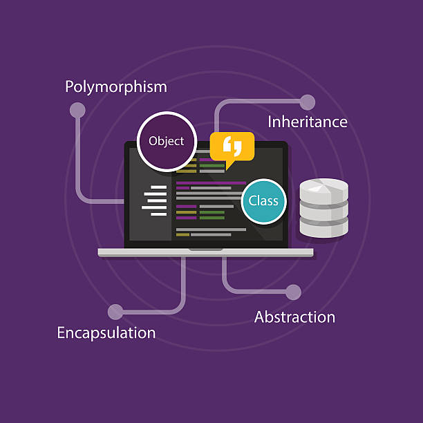
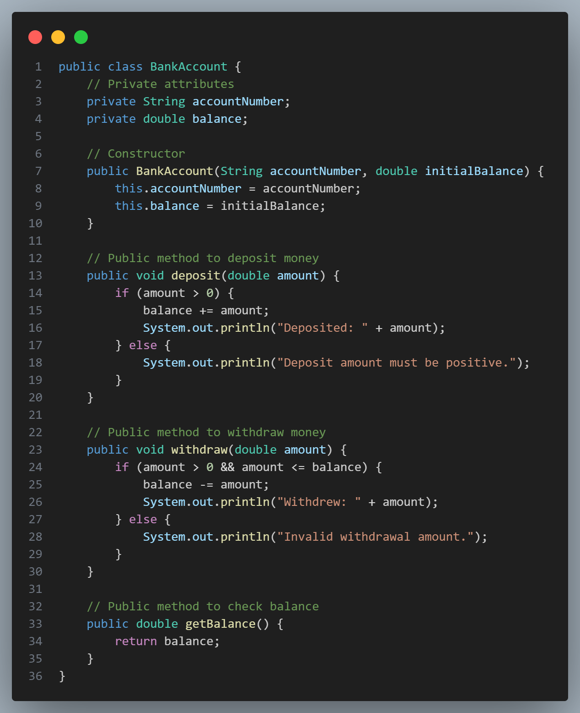

# [Object Oriented Design (OOD)](#object-oriented-design-ood)

Object-Oriented Design (OOD) is a programming paradigm centered around the concepts of "objects," which represent real-world entities and encapsulate data and behavior. OOD emphasizes creating modular, reusable, and maintainable code by organizing software into well-defined structures.

Here are the core concepts of OOD:

<p align="center">
 
</p>


# [Core Principles of Object-Oriented Design (OOD)](#core-principles-of-object-oriented-design-ood)

## [Encapsulation](#encapsulation)

Encapsulation is one of the fundamental principles of Object-Oriented Design (OOD) that refers to the bundling of data (attributes) and methods (functions) that operate on that data into a single unit, or object. This concept allows for data hiding and protects the internal state of the object from direct modification, thus promoting data integrity and abstraction.

### Key Aspects of Encapsulation -

#### Data Hiding:

Encapsulation restricts direct access to some of an object's components, which is known as data hiding.  
Only the methods defined in the class can access and modify the internal state of the object, preventing outside interference and misuse.

#### Public and Private Access Modifiers:

Attributes of a class can be marked as private or protected, meaning they cannot be accessed directly from outside the class. Only public methods (also known as getters and setters) can interact with these attributes.  
Example:  
Private attribute: Only accessible within the class itself.  
Public methods: Can be used by other classes or code to access or modify the private attributes.

#### Control Over Data:

By exposing methods to interact with the internal state, the class can enforce rules or constraints when data is accessed or modified. This ensures that the object remains in a valid state.  
For example, a class can validate input values before setting them, ensuring that an object does not enter an inconsistent or invalid state.

### Example of Encapsulation in Java -

Here’s a simple Java example to illustrate encapsulation:

<p align="center">
 
</p>

```java
public class BankAccount {
    // Private attributes
    private String accountNumber;
    private double balance;

    // Constructor
    public BankAccount(String accountNumber, double initialBalance) {
        this.accountNumber = accountNumber;
        this.balance = initialBalance;
    }

    // Public method to deposit money
    public void deposit(double amount) {
        if (amount > 0) {
            balance += amount;
            System.out.println("Deposited: " + amount);
        } else {
            System.out.println("Deposit amount must be positive.");
        }
    }

    // Public method to withdraw money
    public void withdraw(double amount) {
        if (amount > 0 && amount <= balance) {
            balance -= amount;
            System.out.println("Withdrew: " + amount);
        } else {
            System.out.println("Invalid withdrawal amount.");
        }
    }

    // Public method to check balance
    public double getBalance() {
        return balance;
    }
}
```

#### Explanation of the Example -

**Private Attributes:**  
The accountNumber and balance attributes are marked as private, so they cannot be accessed directly from outside the BankAccount class.

**Public Methods:**  
The deposit and withdraw methods allow controlled access to modify the balance attribute. These methods contain logic to check whether the amount is valid before performing the operation.

**Getters:**  
The getBalance method allows outside code to retrieve the current balance without exposing the balance attribute directly.

### Advantages of Encapsulation -

Improved Data Security: By restricting access to an object’s data, encapsulation prevents accidental changes or corruption.  
Modularity: Changes in the implementation of the class do not affect other classes that use it, as long as the public interface remains unchanged.  
Ease of Maintenance: Since the internal workings of a class are hidden, developers can modify and maintain the class without worrying about breaking the code that relies on it.  
Abstraction: Encapsulation promotes abstraction by allowing the user to interact with an object without needing to understand its inner workings.

## [Abstraction](#abstraction)

Simplifies complex reality by modeling classes based on the essential properties and behaviors of an object.  
Allows developers to focus on interactions at a high level without needing to understand all the implementation details.

## [Inheritance](#inheritance)

Enables new classes to inherit properties and methods from existing classes, promoting code reuse and establishing a hierarchical relationship between classes.  
Supports polymorphism, where derived classes can override methods of their parent class.

## [Polymorphism](#polymorphism)

Allows objects of different classes to be treated as objects of a common superclass, enabling the same interface to be used for different underlying forms (data types).  
Includes method overriding (same method name in child class) and method overloading (same method name but different parameters).
